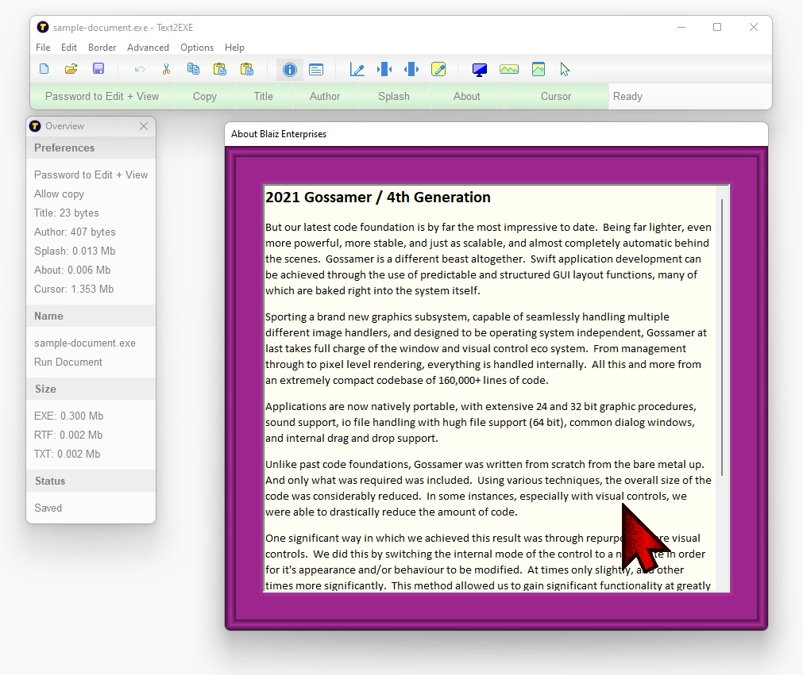
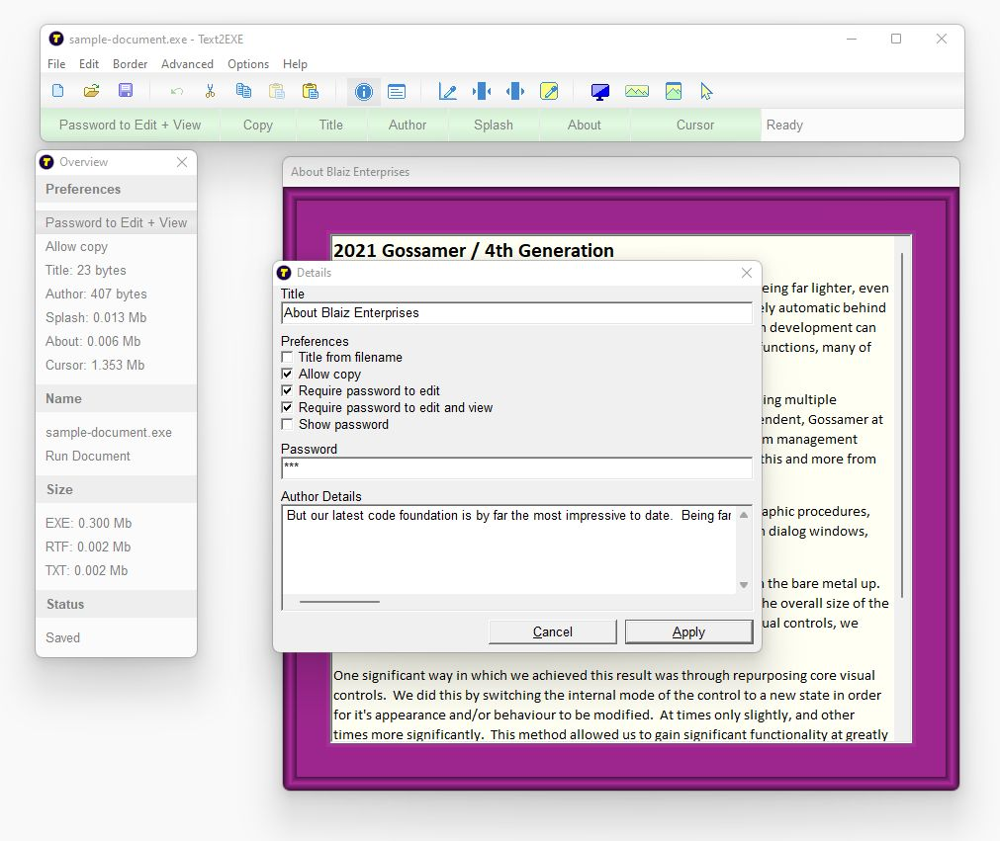
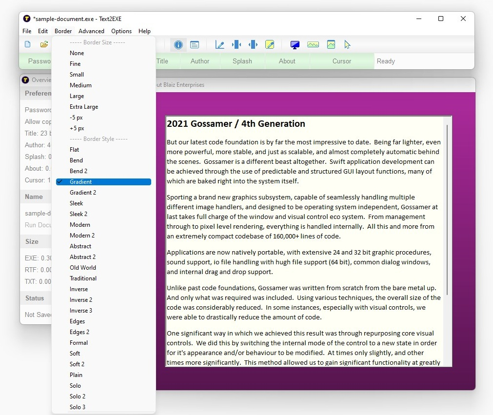
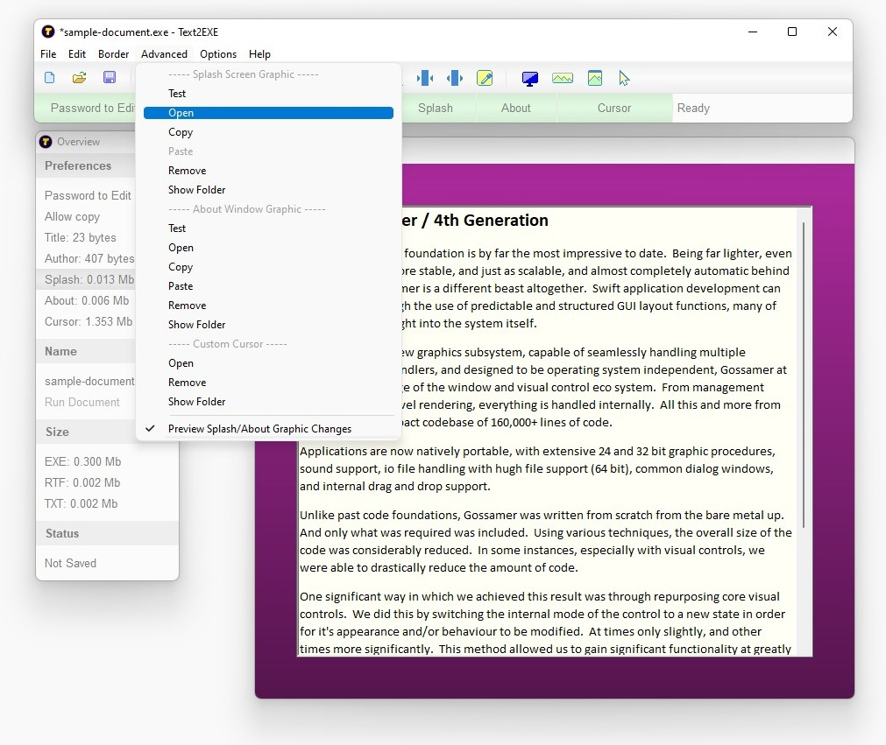

# Text2EXE v1.0.1531 / 20nov2025 / MIT License
Convert a plain text (txt) or Rich Text Format (rtf) document into a standalone Windows app (exe). Style and edit text in WordPad etc, copy text to Clipboard and paste into Text2EXE, adjust document features, then save to file as a portable app (.exe file).

# Features
* Allow or deny text/selection copy
* Customise border size, color and style, and document background color
* Set a custom splash screen graphic (stored as PNG image)
* Set a custom about window graphic (stored as PNG image)
* Set a custom cursor (support for ANI, CUR and ICO cursor formats)
* Set a custom author blurb (from document "right click > Author" to view - supports plain text)
* Enter a custom document title, or automatically derive one from saved filename
* Option: Password to edit
* Option: Password to view (document encrypted upon save) 
* Option: Automatically preview splash screen/about window graphic changes
* Define 3 distinct default templates (File > Make Default 1-3) for rapid reuse
* Create a new document using default template (File > New Default 1-3) 
* One click to run/preview final .exe document (Overview > Run Document)
* Interactive Overview window for one-click access to important document features and options
* Updated interactive toolbar and statusbar
* Portable

# Download
Download <a href="src/text2exe.exe">text2exe.exe</a> or from the "<a href="bin/">bin</a>" or "<a href="src/">src</a>" folders above.

# Images

